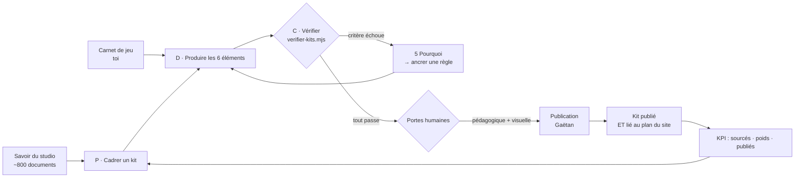

# 🎯 Objectifs — Vault Metroid

> **État : COMPLET.** Trois objectifs, chacun avec **son critère de réussite**, **son échéance** et
> **qui l'anime** — plus le schéma de la boucle, qui se dessine tout seul dans Obsidian.
>
> ⚠️ **Ils sont PROPOSÉS, et ils sont dérivés** : de la matière reçue, des huit notes de référence,
> et du cadrage pédagogique arrêté aujourd'hui (kit de la collection, public scolaire).
> *Un objectif qu'un agent invente est une hypothèse ; un objectif **dérivé et corrigeable** est un
> point de départ. **Corrige-les d'un trait** — c'est la dernière chose que ce vault ne peut pas
> décider à ta place.*

---

## 1. Les trois objectifs

### 🎓 O1 — Faire de ce vault un **kit pédagogique publié**

| | |
|---|---|
| **Quoi** | Le vault devient un **kit** de la collection `ecole/dossiers-pedagogiques/`, puis **une page de l'espace démo** |
| **Critère de réussite** | **mesurable, et déjà outillé** : `node forge-ia/verifier-kits.mjs` rend **« les critères comptables passent »**, **et** le kit est **atteignable depuis le plan du site** — *pas seulement par son adresse* |
| **Échéance** | **à caler par toi.** ⚠️ Un ancrage existe : le pôle Japan/otaku/gaming porte **JOF Metz les 26-27 septembre 2026** — *si le kit doit servir là, la date est celle-là ; sinon, elle est libre* |
| **Qui l'anime** | **l'agent produit et mesure** · **toi tu valides et tu publies** |

> **Ce qui est déjà fait** : 8 notes sourcées, le [[dossier-metroid-360|dossier 360]] par niveau scolaire, le [[glossaire]],
> les [[exercices-et-controles|exercices]], **et le verdict qui passe**. **Ce qui manque** : le gabarit de kit (passe 1) et la page.

### 🎮 O2 — Le **carnet de jeu** alimente le kit

| | |
|---|---|
| **Quoi** | Le [[carnet-de-jeu|carnet]] n'est pas une annexe : c'est **la seule mesure que ce vault produise lui-même** |
| **Critère de réussite** | **chaque entrée relie un fait vécu à une note du kit** — *« j'ai fini le jeu en sautant tel boss → voilà ce que la note 06 dit du sequence breaking »* |
| **Échéance** | à chaque session de jeu, sans cérémonie |
| **Qui l'anime** | **toi** (tu joues et tu notes) · **l'agent** met en forme et relie |

⚠️ **L'entrée en cours attend encore trois informations** : la **catégorie**, le **temps**, la **date**.
*Un carnet qui note « j'ai joué » n'est pas un carnet.*

### 🔁 O3 — La méthode devient **reproductible**

| | |
|---|---|
| **Quoi** | Ce qui marche ici doit marcher **pour un autre sujet** : *le studio a ~800 documents ; le kit est le format qui les rend transmissibles* |
| **Critère de réussite** | **un deuxième kit produit avec le même gabarit**, et **le vérificateur rend un verdict aux deux** — *un kit qu'on ne mesure pas n'est pas un kit, c'est un document* |
| **Échéance** | après la passe 1 (le gabarit) |
| **Qui l'anime** | **l'agent** — c'est le seul des trois qui ne te demande rien |

---

## 2. Le schéma — la boucle, d'un coup d'œil

**Ce que le schéma dit et qu'un tableau ne dit pas** : *la boucle **revient** au cadrage.* Un kit
publié **nourrit** le suivant — c'est ce qui rend le cycle **continu** au lieu d'être une file.

---

## 3. Qui anime quoi — les rôles

| Rôle | Qui | Ce qu'il anime |
|---|---|---|
| **L'animation du cycle** | **l'agent** | cadrer, produire, **mesurer**, corriger, écrire les rétros |
| **L'animation du jeu** | **toi** | jouer, noter (catégorie · temps · date), décider |
| **Les trois portes** | **toi** | validation **pédagogique** · validation **visuelle** · **publication** |
| **La pause et la reprise** | **l'agent** | écrire la reprise de 5 lignes avant chaque arrêt · **relire et vérifier sur le disque** avant de reprendre |

**Et la règle qui protège tout ça** : *« l'amélioration continue ne doit jamais cannibaliser la
traction »* — **R&D bornée à moins de 20 %**.

---

## 4. Où en est chaque objectif, aujourd'hui

| Objectif | Avancement mesuré |
|---|---|
| **O1** — kit publié | 🟡 **80 %** : le contenu et le vérificateur sont là (**verdict ✅**), il manque le **gabarit** et la **page** |
| **O2** — carnet | 🟡 **1 entrée ouverte**, **3 informations manquantes** |
| **O3** — reproductible | ⬜ **pas commencé** : il attend la passe 1 |

---

## 5. Ce que ces objectifs ne sont pas

- **Ils ne sont pas définitifs** : ils sont **proposés**, dérivés de la matière — *tu les corriges.*
- **Ils n'engagent pas la diffusion.** Proposer un kit à une école **engage le studio** —
  disponibilité, assurance, et le jour où un établissement dit oui. **Décision D12**, et l'accord
  JOF reste ouvert.
- **Ils ne fixent pas le nombre de kits.** *Moins de kits, mieux faits* est une réponse acceptable.
- **Ils ne promettent aucune validation pédagogique** : le cadre de la collection le dit —
  **aucune séance n'a été testée devant un élève**, et **un agent ne peut pas trancher si une
  question est trop dure pour un CE2**.
- **Ils ne comptent pas en heures.** *Aucune estimation de temps n'est donnée : elle serait inventée.*

---

*GL Digital Lab — 14/09/2026. Objectifs dérivés du vault (8 notes sourcées), du cadrage pédagogique
(`ecole/kits-pedagogiques-PASSE-0-inventaire-2026-09-14.md`) et du cycle
(`ecole/kits-pedagogiques-CYCLE-2026-09-14.md`). Critère outillé : `forge-ia/verifier-kits.mjs`.*
